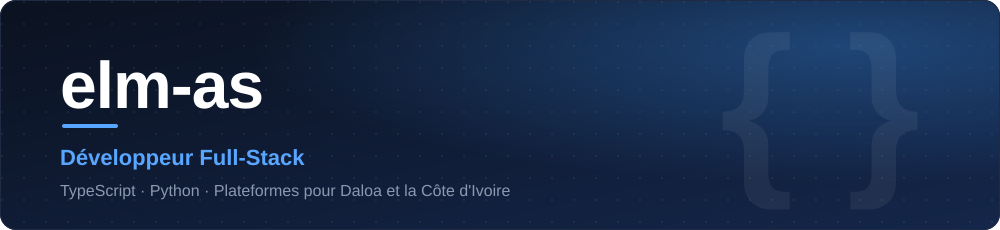
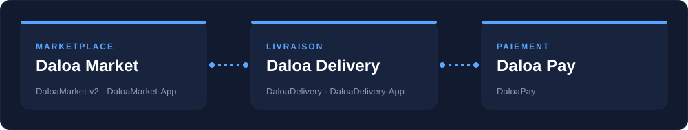
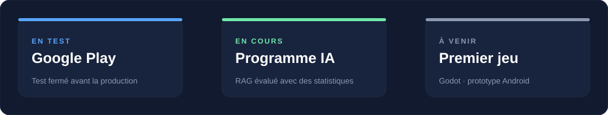
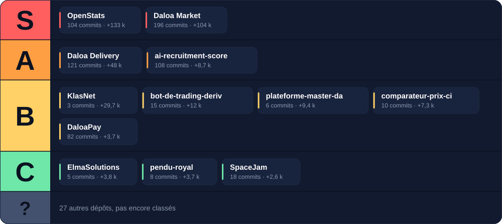
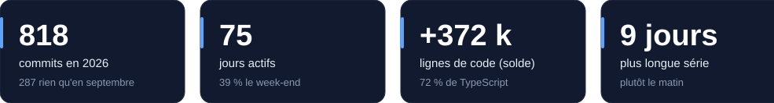
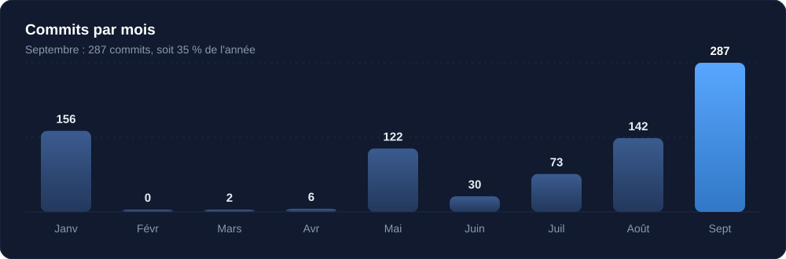
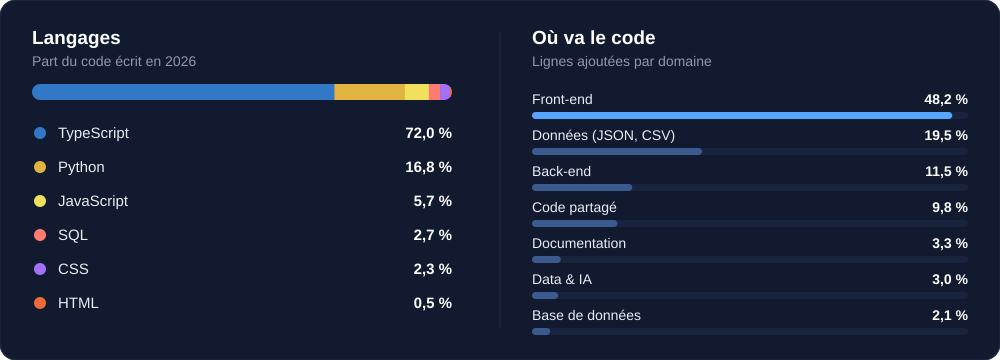

<p align="center">
  
</p>

<p align="center">
  
</p>

<p align="center">
  <a href="https://www.linkedin.com/in/elmas-dev"></a>
  <a href="mailto:elmastresoroulobo@gmail.com"></a>
</p>

## 🎯 Qui je suis

<table>
<tr>
<td width="60%" valign="top">

```python
elmas = {
    "base": "Abidjan, Côte d'Ivoire",
    "parcours": "Licence en modélisation statistique -> Master Data Science et IA",
    "universites": ["UFHB", "Université Rennes 2"],

    "je_construis": [
        "Daloa Market",
        "Daloa Delivery",
        "Daloa Pay",
        "OpenStats",
    ],

    "j_apprends": [
        "RAG et évaluation",
        "Godot",
        "Jeux vidéo mobiles",
    ],

    "stack": {
        "langages": ["TypeScript", "Python", "SQL"],
        "web": ["React", "Vite", "Tailwind"],
        "backend": ["Supabase", "PostgreSQL"],
    },

    "ouvert_a": [
        "missions freelance",
        "collaborations",
        "projets à impact local",
    ],
}
```

</td>
<td width="40%" valign="top">

**En ce moment**

- 🧪 Test fermé sur Google Play pour DaloaMarket et DaloaDelivery
- 📚 Programme IA de 12 semaines : un RAG évalué avec des statistiques
- 🎮 Bientôt : un premier jeu, avec Godot

*Open to remote freelance missions in data, AI and web development.*

</td>
</tr>
</table>

## 🌍 L'écosystème Daloa

<p align="center">
  
</p>

## 🧭 En cours et à venir

<p align="center">
  
</p>

## 🏅 Mes projets, en tier list

<p align="center">
  
</p>

Le classement tient compte du poids de chaque projet (commits et lignes de code) et de son rôle dans mon écosystème. OpenStats regroupe les anciens dépôts `OpenStats` et `Stats`, Daloa Market regroupe `DaloaMarket-v2` et `DaloaMarket-App`, Daloa Delivery regroupe `DaloaDelivery` et `DaloaDelivery-App`.

<details>
<summary>Voir les dépôts et les chiffres détaillés</summary>

<br/>

| Projet | Dépôts | Commits | Solde de code |
|---|---|--:|--:|
| OpenStats | [OpenStats](https://github.com/elm-as/OpenStats), [Stats](https://github.com/elm-as/Stats) | 104 | +133 114 |
| Daloa Market | [DaloaMarket-v2](https://github.com/elm-as/DaloaMarket-v2), [DaloaMarket-App](https://github.com/elm-as/DaloaMarket-App) | 196 | +103 798 |
| Daloa Delivery | [DaloaDelivery](https://github.com/elm-as/DaloaDelivery), [DaloaDelivery-App](https://github.com/elm-as/DaloaDelivery-App) | 121 | +48 339 |
| ai-recruitment-score | [ai-recruitment-score](https://github.com/elm-as/ai-recruitment-score) | 108 | +8 696 |
| KlasNet | [KlasNet](https://github.com/elm-as/KlasNet) | 3 | +29 658 |
| bot-de-trading-deriv | [bot-de-trading-deriv](https://github.com/elm-as/bot-de-trading-deriv) | 15 | +11 972 |
| plateforme-master-da | [plateforme-master-da](https://github.com/elm-as/plateforme-master-da) | 6 | +9 409 |
| comparateur-prix-ci | [comparateur-prix-ci](https://github.com/elm-as/comparateur-prix-ci) | 10 | +7 256 |
| DaloaPay | [DaloaPay](https://github.com/elm-as/DaloaPay) | 82 | +3 729 |
| ElmaSolutions | [ElmaSolutions](https://github.com/elm-as/ElmaSolutions) | 5 | +3 847 |
| pendu-royal | [pendu-royal](https://github.com/elm-as/pendu-royal) | 8 | +3 674 |
| SpaceJam | [SpaceJam](https://github.com/elm-as/SpaceJam) | 18 | +2 550 |

</details>

## 🧰 Ma boîte à outils

<table align="center">
<tr>
<td width="50%" align="center" valign="top">

<h3>💻 Langages et web</h3>


<br/><br/>


<br/><br/>

<h3>🗄️ Backend et base de données</h3>


</td>
<td width="50%" align="center" valign="top">

<h3>📊 Data et IA</h3>


<br/>


<br/><br/>

<h3>🎮 En apprentissage</h3>


<br/><br/>

<h3>🔧 Outils</h3>


</td>
</tr>
</table>

<!-- Ajoute ici ce que tu utilises vraiment (Next.js, Node, FastAPI, Docker...). Garde seulement ce que tu maîtrises. -->

## 📊 2026 en chiffres

<p align="center">
  
</p>

<p align="center">
  
</p>

<p align="center">
  
</p>

<p align="center">
  
  
</p>

<p align="center">
  
</p>

## 📈 Activité

<p align="center">
  
</p>

<p align="center">
  
</p>

## 🤝 Me contacter

Ouvert aux collaborations, aux missions freelance et aux projets à impact local : [LinkedIn](https://www.linkedin.com/in/elmas-dev) ou [e-mail](mailto:elmastresoroulobo@gmail.com).

<p align="center">
  
</p>
